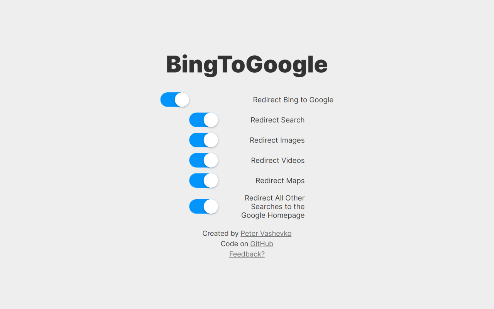
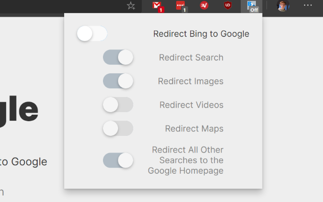

# BingToGoogle
A Chrome extension to redirect all Bing searches to Google.

This extension will automatically redirect all text, image, video, map, and other searches made using Bing to Google.
The extension can be configured to only redirect certain search types using the options page.
You can also click on the menu bar icon to open a popup with the extension's options.
The extension's menu bar icon has a badge to show whether redirects are on.

## Installation
The extension can be installed [here on the Chrome Web Store](https://chrome.google.com/webstore/detail/bingtogoogle/aioaooaikcpfineockocdhfabodoepgi).

## Screenshots

## Feedback?
Email me at [peter@vashevko.com](mailto:peter@vashevko.com?subject=BingToGoogle%20Feedback).

## License
This project is licensed under the MIT license.